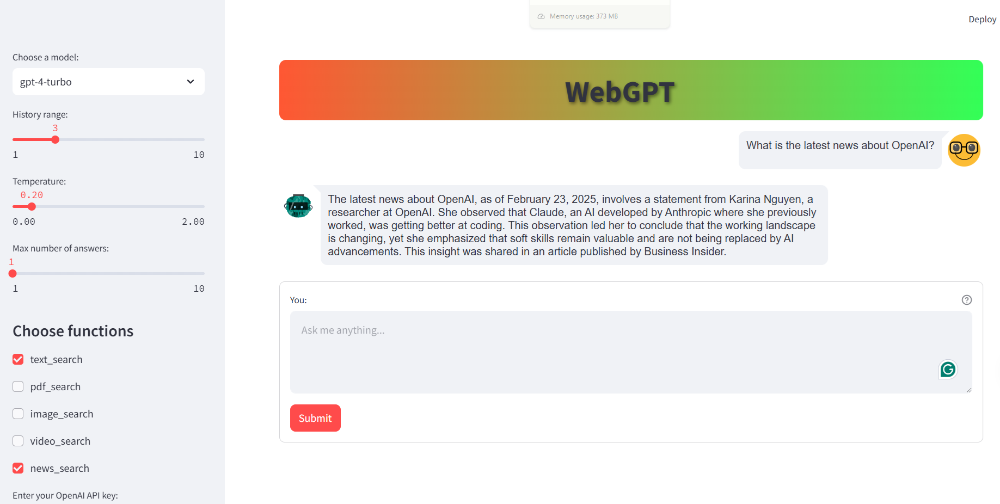

# Chatbot with Web Search and Function Calling

  
*A chatbot leveraging DuckDuckGo for web search and OpenAI for function calling.*

## Overview
This chatbot is designed to handle user queries by integrating:
- **DuckDuckGo** for real-time web search.
- **OpenAI models** for natural language processing and function calling.
- **DeepSeek models** for enhanced understanding and responses.

## Features
✅ **Real-time Web Search**: Uses DuckDuckGo to fetch the latest information.  
✅ **Function Calling**: OpenAI models execute functions based on the user's intent.  
✅ **Multi-Model Support**: Uses both OpenAI and DeepSeek models for different tasks.  
✅ **Interactive Conversational Flow**: Responds in a human-like manner, improving user experience.  

## Installation

### Prerequisites
Ensure you have the following installed:
- Python 3.8+
- openai, ducduckgo, streamlit

### Clone the Repository
```bash
$ git clone https://github.com/MohsenMozaffary/NLP
$ cd WebGPT
```


## Configuration

### API Keys
You need API keys for OpenAI.
```

## Usage
Run the chatbot using:
```bash
$ streamlit run WebSearch_app.py
```
Then, start interacting by typing your queries.


User: Summarize this article: https://example.com
Bot: The article discusses...
```

## Contributing
Feel free to submit issues and pull requests to enhance the chatbot.

## License
This project is licensed under the MIT License.

## Contact
For questions or collaboration, reach out to [your email].
